# Relazione Progetto SSDLC - SecDevOps

## 1. Introduzione
Questo progetto ha l’obiettivo di implementare un processo di sviluppo sicuro (SSDLC) applicato a un progetto software Java, attraverso la configurazione di una pipeline CI/CD automatizzata. La pipeline integra strumenti di analisi statica del codice (SAST) e di analisi delle librerie di terze parti (SCA) per garantire la qualità e la sicurezza del software.

L’approccio adottato simula un contesto reale, con controlli automatizzati che interrompono il processo di build in caso di non conformità ai requisiti di sicurezza e qualità, aumentando l’efficacia del rilascio continuo.

Nel report saranno dettagliate tutte le fasi di configurazione, i risultati delle analisi e le azioni correttive applicate, corredate da evidenze visive tramite screenshot.

## 2. Configurazione ambiente e pipeline

L'intera pipeline è stata realizzata tramite **Jenkins in ambiente Docker**, con container separati per Jenkins e SonarQube. Questa scelta ha garantito isolamento, ripetibilità e facilità nella gestione.

Il codice sorgente è basato sul repository Java [onlinebookstore](https://github.com/shashirajraja/onlinebookstore), compilato tramite **Maven**. Il `Jenkinsfile` definisce tutti gli step del processo CI/CD, con controlli automatici di sicurezza e qualità.

La pipeline è configurata per avviarsi automaticamente ad ogni push (commit) sul repository Git, garantendo un feedback immediato sul codice.

### Strumenti utilizzati

* **Build/Test**: Maven
* **SAST (Static Application Security Testing)**:
    * SonarQube (scanner CLI in Docker)
    * PMD (plugin Warnings NG)
* **SCA (Software Composition Analysis)**:
    * OWASP Dependency-Check (plugin Jenkins)
* **Notifiche**:
    * Email (plugin `emailext`)
    * Telegram (bot via API `curl`)
* **Gate di sicurezza**:
    * SonarQube Quality Gate
    * OWASP Dependency-Check (zero vulnerabilità High/Critical ammesse)


### Descrizione dettagliata degli step

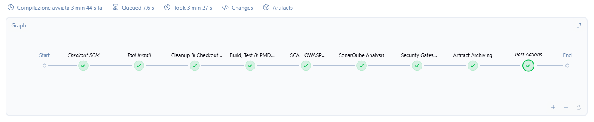


* **Stage 1 – Cleanup & Checkout SCM**
    Pulizia workspace, clonazione repository Git e creazione cartella per i report.

* **Stage 2 – Build, Test & PMD Analysis**
    Comando eseguito:
    ```bash
    mvn clean verify pmd:pmd
    ```
    I risultati PMD sono registrati nel blocco `post`:
    ```
    recordIssues tools: [pmdParser(pattern: 'target/pmd/pmd.xml')]
    ```

* **Stage 3 – SCA con OWASP Dependency-Check**
    Esecuzione scan:
    ```groovy
    dependencyCheck odcInstallation: 'Dependency-Check', additionalArguments: '--format HTML --format XML --out dependency-check-report'
    ```
    I report HTML e XML sono archiviati come artefatti.

* **Stage 4 – Analisi SAST con SonarQube**
    Scansione tramite Maven con token e ambiente configurati:
    ```bash
    mvn sonar:sonar -Dsonar.projectKey=onlinebookstore -Dsonar.login=$SONAR_TOKEN -Dsonar.coverage.jacoco.xmlReportPaths=target/site/jacoco/jacoco.xml
    ```
    Questo comando integra i report di copertura del codice generati da Jacoco, uno strumento che misura quali parti del codice sono state eseguite dai test unitari, permettendo a SonarQube di visualizzare e valutare la copertura del progetto.
    

* **Stage 5 – Security Gates Evaluation**
    Verifica dei gate con:
    * SonarQube Quality Gate tramite `waitForQualityGate()`, con timeout e retry
    * OWASP Dependency-Check tramite publisher Jenkins:
        ```groovy
        dependencyCheckPublisher pattern: 'dependency-check-report/dependency-check-report.xml',
            failedTotalHigh: 0,
            failedTotalCritical: 0,
            stopBuild: true
        ```
    Se uno dei due gate fallisce, la pipeline termina con errore:
    ```groovy
    currentBuild.result = 'FAILURE'
    error 'Security Quality Gates Failed!'
    ```

* **Stage 6 – Artifact Archiving**
    Vengono archiviati i file `.war` generati solo se presenti:
    ```groovy
    archiveArtifacts artifacts: 'target/*.war', fingerprint: true
    ```
    **Nota:** i report di OWASP Dependency-Check vengono archiviati nello stage 3, mentre in questo stage si archivia solo il package deployabile (.war).
* **Stage 7 – Notifiche Post-Build**
    Sia in caso di successo che di fallimento, le notifiche sono inviate via:
    * Email tramite plugin `emailext`
    * Telegram via bot API chiamata `curl`

    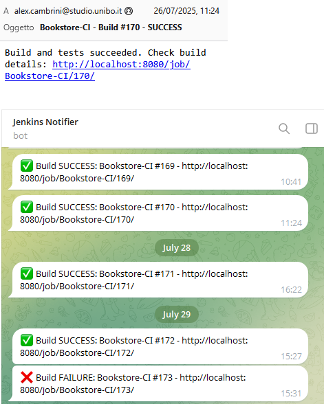  

## 3. Analisi delle librerie (SCA)

### Strumenti utilizzati
Per l’analisi delle librerie di terze parti è stato utilizzato OWASP Dependency-Check, integrato nella pipeline Jenkins tramite plugin. Questo strumento identifica vulnerabilità note nelle dipendenze basandosi su database CVE.

### Vulnerabilità trovate
Durante la scansione sono state rilevate vulnerabilità nelle librerie utilizzate, con dettagli che saranno approfonditi nei report generati.

### Screenshot significativi
  

*Report generato da OWASP Dependency-Check con le vulnerabilità rilevate.*

### Gravità e impatto delle vulnerabilità
Le vulnerabilità identificate possono compromettere la sicurezza dell’applicazione, con possibili rischi di attacchi e malfunzionamenti.

### Azioni correttive applicate
Sono state pianificate e applicate le necessarie azioni correttive, come aggiornamenti e sostituzioni delle librerie vulnerabili.


## 4. Analisi del codice (SAST)

### Strumenti utilizzati
Per l’analisi statica del codice sono stati utilizzati SonarQube e PMD Warnings NG.  
- **SonarQube** analizza la qualità del codice, evidenziando bug, vulnerabilità e code smell.  
- **PMD Warnings NG** rileva problemi di stile e bad practices tramite regole configurate.

I due strumenti si integrano per offrire un’analisi completa e dettagliata della qualità e sicurezza del codice.

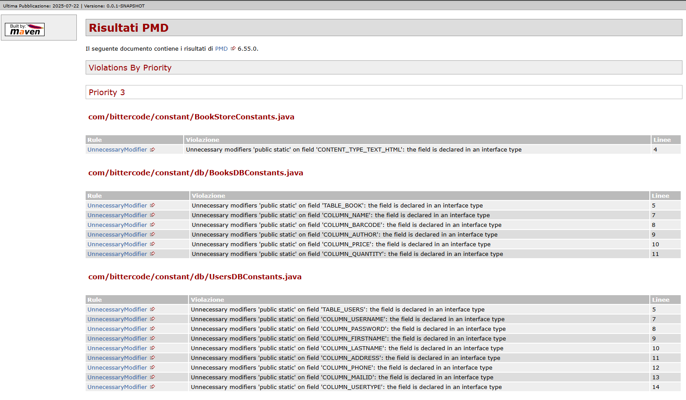
### Risultati delle scansioni
Le scansioni hanno identificato diverse vulnerabilità e problemi di qualità, con un focus sulle aree critiche del codice. I risultati sono stati raccolti nei report generati e visualizzati in Jenkins e SonarQube.

### Panoramica vulnerabilità critiche

Le prime scansioni hanno evidenziato diverse criticità sul progetto:

- **Sicurezza**: 8 vulnerabilità
- **Affidabilità**: 44 problemi
- **Manutenibilità**: 106 problemi
- **Copertura**: 0.0% 
- **Duplicazione del codice**: 10.6%
- **Security Hotspot**: 59 rilevati

Tutti questi problemi sono stati progressivamente analizzati e risolti. Per migliorare la copertura del codice, inizialmente a zero, abbiamo integrato Jacoco nella pipeline (come configurato nello Stage 4) e scritto test unitari dedicati. Questo ha permesso di aumentare significativamente la percentuale di codice coperto, contribuendo a rendere l'applicazione più robusta e stabile. Un approfondimento su 10 vulnerabilità critiche è riportato nella sezione successiva, con dettagli tecnici, screenshot e suggerimenti di fix.


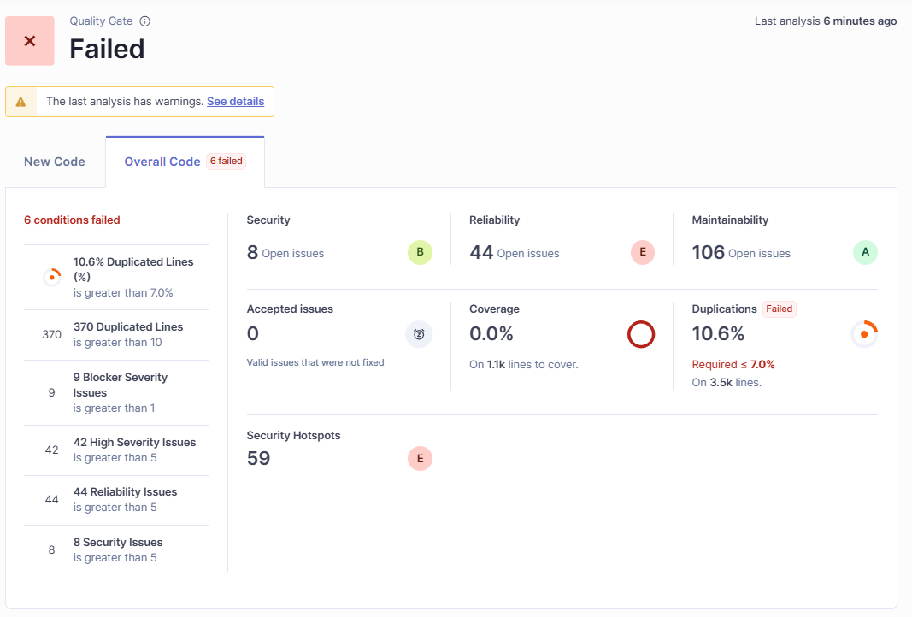

### Configurazione Quality Gate
I Quality Gate di SonarQube sono stati personalizzati con condizioni differenziate tra nuovo codice e codice complessivo, per controllare aspetti di sicurezza, affidabilità, duplicazioni e copertura.  
Questa configurazione garantisce che la pipeline venga bloccata in caso di superamento delle soglie stabilite, assicurando così la qualità e sicurezza del software. 

I dettagli delle condizioni sono visibili negli screnshots allegati.
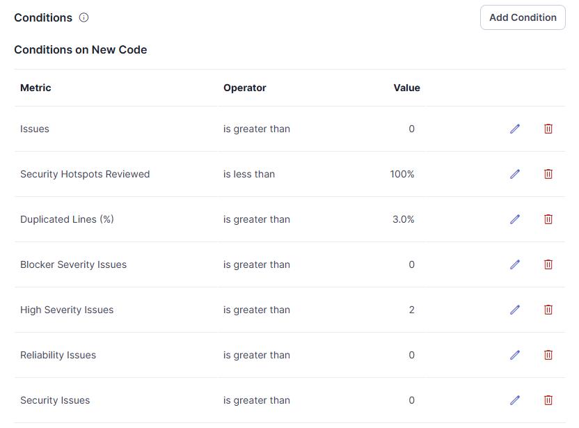  
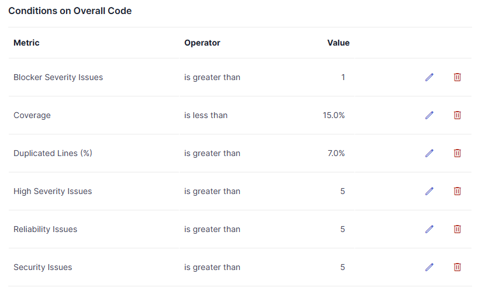  

## 5. Approfondimento 10 vulnerabilità

[Approfondimento sulle 10 vulnerabilità](./approfondimento_vulnerabilita.md)

## 6. Risoluzione delle vulnerabilità critiche
### 6.1 Gestione non sicura di IOException in BuyBooksServlet.java

#### ❌ Security issue:  
La chiamata a `res.getWriter()` non era gestita. In caso di errore I/O (es. connessione chiusa), poteva lanciare `IOException` non gestita, causando crash, stack trace visibili o comportamento anomalo.
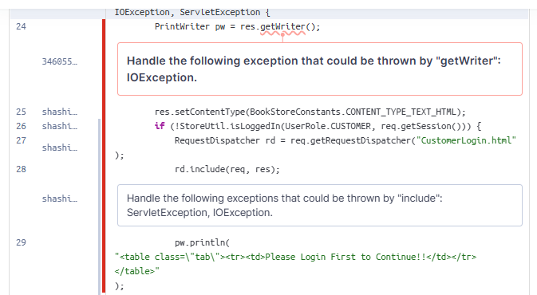 

**Codice vulnerabile:**
```java
PrintWriter pw = res.getWriter();
res.setContentType(BookStoreConstants.CONTENT_TYPE_TEXT_HTML);
```
In caso di errore I/O (es. connessione interrotta), il metodo può lanciare IOException, non gestita qui. Questo può causare crash, leak di stack trace o comportamenti anomali.


#### ✅ Mitigazione implementata
Risolto con blocco try-with-resources per gestire l’eccezione e chiudere il writer in modo sicuro:
```java
res.setContentType(BookStoreConstants.CONTENT_TYPE_TEXT_HTML);
try (PrintWriter pw = res.getWriter()) {

    // logica applicativa
} catch (IOException e) {
    log.error("Errore I/O durante la scrittura della risposta", e);
    res.sendError(HttpServletResponse.SC_INTERNAL_SERVER_ERROR, "Errore interno");
}
```


#### Classificazione
CWE-703 – Improper Check or Handling of Exceptional Conditions

OWASP A05:2021 – Security Misconfiguration

Gravità: Media

Fix: Gestione sicura con try/catch, logging, e risposta controllata all’utente.


### 6.2 Dipendenza obsoleta e vulnerabile: webapp-runner

#### ❌ Security issue:  
Il progetto utilizzava webapp-runner versione 8.0.30.2 (gruppo com.github.jsimone), che include la libreria Netty 3.5.5, versione vulnerabile con molteplici CVE note:

CVE-2019-20444, CVE-2019-20445, CVE-2015-2156, CVE-2019-16869, CVE-2020-11612, CVE-2021-37136, CVE-2021-37137, CVE-2022-41881, CVE-2023-44487  
- Diverse vulnerabilità DoS e bypass di autenticazione.

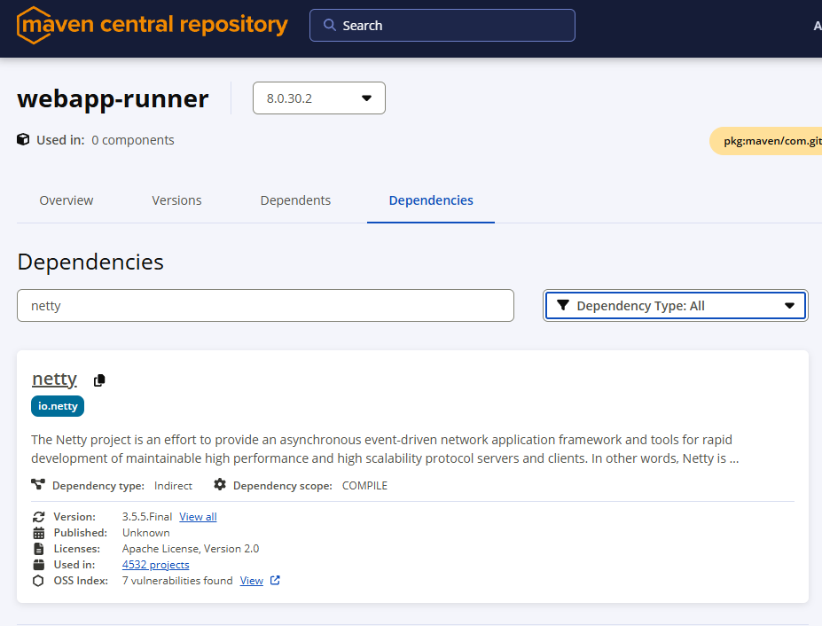  
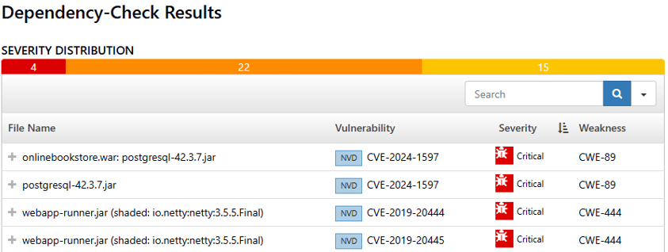  


📌 Evidenza:
Lo strumento OWASP Dependency-Check ha segnalato che la versione 8.0.30.2 di webapp-runner include una versione obsoleta e vulnerabile di Netty (3.5.5), non più mantenuta.

Inizialmente è stata testata la versione 9.0.27.1 (stesso groupId/artifactId), che però non risolveva la vulnerabilità perché nel package era comunque presente la libreria Netty 3.5.5, anche se non dichiarata come dipendenza esplicita su Maven Repository. Per questo si è optato per la versione 10.1.42.0, con groupId aggiornato e artifactId uguale, che include fix completi.

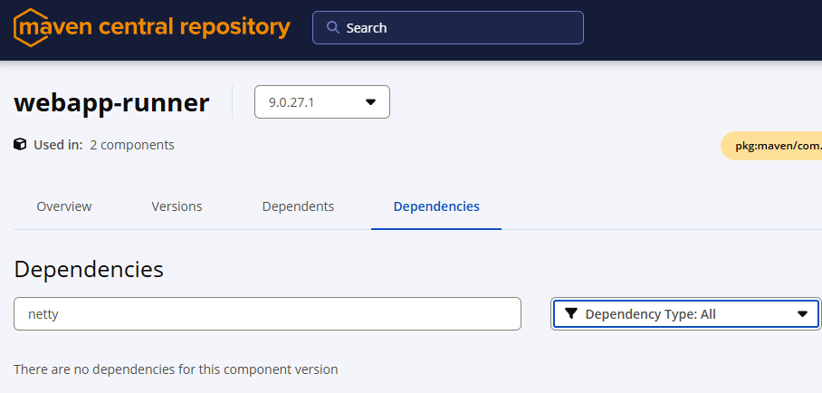 
```xml

<--- Codice Iniziale --->
<artifactItem>
    <groupId>com.github.jsimone</groupId>
    <artifactId>webapp-runner</artifactId>
    <version>8.0.30.2</version>
    <destFileName>webapp-runner.jar</destFileName>
</artifactItem>

<--- Codice aggiornato --->
<artifactItem>
    <groupId>com.heroku</groupId>
    <artifactId>webapp-runner</artifactId>
    <version>10.1.42.0</version>
    <destFileName>webapp-runner.jar</destFileName>
</artifactItem>
```
## 7. Conclusioni
Le immagini mostrano che, a seguito delle correzioni, il codice modificato supera il Quality Gate, confermando la risoluzione delle vulnerabilità critiche individuate.

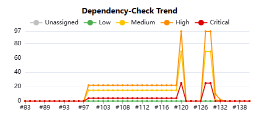  
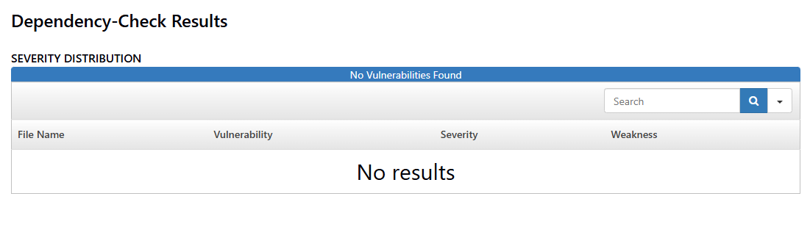  
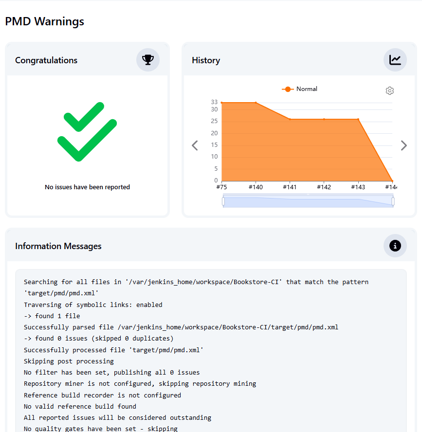  
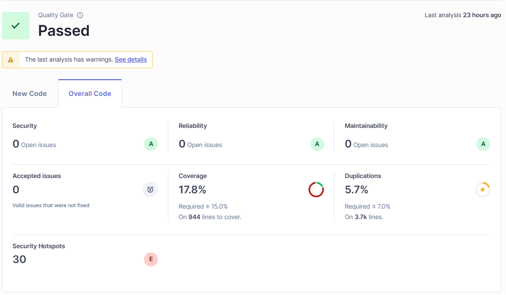