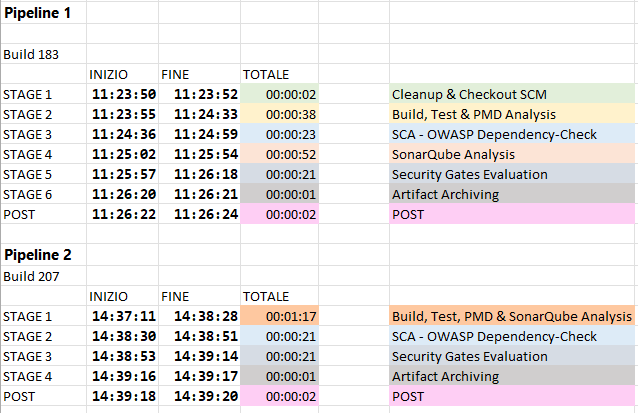

# Report Confronto Pipeline Jenkins e Ottimizzazioni

## Descrizione

Sono state confrontate due versioni di pipeline Jenkins con analisi di sicurezza e qualità codice (PMD, SonarQube, OWASP Dependency-Check).

La seconda pipeline risparmia circa 10-15 secondi rispetto alla prima.

---

## Differenze principali tra le pipeline

| Aspetto                   | Pipeline 1                                         | Pipeline 2                                   |
|---------------------------|--------------------------------------------------|----------------------------------------------|
| Pulizia workspace         | `cleanWs()` all’inizio per pulire tutto          | Nessun `cleanWs()`                           |
| Checkout SCM              | Separato in stage dedicato                        | Unico stage con build, test, Sonar, PMD     |
| Build & Sonar             | Due stage separati (Build+PMD e SonarQube)       | Unico stage con `mvn clean verify pmd:pmd sonar:sonar` |
| Cartella report OWASP     | `dependency-check-report` creata con `mkdir`     | Cartella `target` (cartella Maven standard)  |
| Timeout e retry           | Timeout dedicati per ogni step, retry SonarQube  | Timeout unico più grande, retry SonarQube    |

---

## Analisi del risparmio di tempo

1. **Unificazione degli stage**  
   Riduce overhead di setup e teardown.

2. **Rimozione di `cleanWs()`**  
   Evita la pulizia manuale (circa 2 secondi), possibile grazie a Maven che pulisce `target` con `mvn clean`.

3. **Report OWASP in `target`**  
   Consente di evitare pulizie manuali aggiuntive.

---

## Verifiche effettuate

- **Pulizia automatica cartella `target`**:  
  Jenkins **non pulisce automaticamente** il workspace o `target` tra build, a meno che non sia specificatamente configurato.  
  Maven con `mvn clean` **pulisce la cartella `target`** ad ogni build, quindi garantisce una pulizia interna.  

- **Sovrascrittura file in `target`**:  
  I file in `target` vengono sovrascritti durante la build se cambia il contenuto, ma la pulizia esplicita tramite `mvn clean` è fondamentale per evitare problemi residui.  

- **Comportamento di `sonar:sonar` nei log delle build**:  
  Dai log emerge che il comando `sonar:sonar` **non esegue la compilazione del codice**: parte direttamente dall’analisi statica, utilizzando i file `.class` già presenti nella cartella `target`.

  Per verificarlo, ho provato a **esplicitare i path `target/classes` e `target/test-classes`** nel comando Sonar al posto del rilevamento automatico: **i tempi non sono cambiati**, confermando che **Maven non invoca la fase di compilazione**.

  A ulteriore conferma, analizzando il log **non compaiono riferimenti alla fase di compilazione**, come ad esempio:  
  `[INFO] Compiling X source files with javac [debug target 1.8] to target/classes`

---

## Test cronometrici eseguiti



*Risparmio stimato: 10-15 secondi grazie a minore overhead e assenza di clean workspace.*

---

## Conclusione
Il risparmio di tempo deriva principalmente dall’integrazione del report OWASP nella cartella `target` gestita da Maven, eliminando la pulizia manuale con `cleanWs()`. Inoltre, l’unificazione di build e analisi in un unico stage riduce l’overhead complessivo. La rimozione dello stage di checkout separato è stata possibile grazie a `mvn clean`, che garantisce una build pulita senza bisogno di pulizie workspace esterne.

## CODICE PRIMA DELLE MODIFICHE:
``` groovy
pipeline {
    agent any
    tools {
        maven 'Maven 3.9.10'
        jdk 'JDK 8'
        nodejs 'NodeGlobal'
    }
    options {
        timeout(time: 60, unit: 'MINUTES')
        timestamps()
    }
    stages {
        //stage 1
        stage('Cleanup & Checkout SCM') {
            steps {
                script {
                    cleanWs()
                    
                }
                echo 'Starting SCM Checkout...'
                checkout scm
                echo 'SCM Checkout completed.'
                sh 'mkdir -p dependency-check-report'
            }
        }
        //stage 2
        stage('Build, Test & PMD Analysis') {
            steps {
                ansiColor('xterm') {
                    echo 'Starting Build, Test & PMD Analysis...'
                    timeout(time: 20, unit: 'MINUTES') {
                        sh 'mvn clean verify pmd:pmd'
                    }
                    echo 'Build, Test & PMD Analysis completed.'
                }
            }
        }
        //stage 3
        stage('SCA - OWASP Dependency-Check') {
            steps {
                ansiColor('xterm') {
                    script {
                        echo 'Starting OWASP Dependency-Check...'
                        dependencyCheck odcInstallation: 'Dependency-Check',
                            additionalArguments: '
                            --format HTML
                            --format XML
                            --out dependency-check-report'
                        echo 'OWASP Dependency-Check scan completed.'
                        archiveArtifacts artifacts: 
                        'dependency-check-report/dependency-check-report.html,
                        dependency-check-report/dependency-check-report.xml',
                        fingerprint: true
                    }
                }
            }
        }
        //stage 4
        stage('SonarQube Analysis') {
            steps {
                ansiColor('xterm') {
                    script {
                        echo 'Starting SonarQube analysis...'
                        retry(2) {
                            withCredentials([string(credentialsId: 'sonar-token', variable: 'SONAR_TOKEN')]) {
                                withSonarQubeEnv('LocalSonarQube') {
                                    sh '
                                    mvn
                                    sonar:sonar
                                    -Dsonar.projectKey=onlinebookstore
                                    -Dsonar.login=$SONAR_TOKEN
                                    -Dsonar.coverage.jacoco.xmlReportPaths=target/site/jacoco/jacoco.xml'
                                }
                            }
                        }
                        echo 'SonarQube analysis completed.'
                    }
                }
            }
        }
        stage('Security Gates Evaluation') {...}
        stage('Artifact Archiving') {...}
    }
    post {...}    
}
```

## CODICE DOPO LE MODIFICHE:
```groovy
pipeline {
    agent any
    tools {
        maven 'Maven 3.9.10'
        jdk 'JDK 8'
    }
    options {
        timeout(time: 60, unit: 'MINUTES')
        timestamps()
    }
    stages {
        //stage 1
        stage('Build, Test, PMD & SonarQube Analysis') {
            steps {
                ansiColor('xterm') {
                    script {
                        echo 'Starting Build, Test, PMD & SonarQube Analysis...'
                        timeout(time: 20, unit: 'MINUTES') {
                            retry(2) { 
                                withCredentials([string(credentialsId: 'sonar-token', variable: 'SONAR_TOKEN')]) {
                                    withSonarQubeEnv('LocalSonarQube') {
                                        sh '
                                        mvn clean
                                        verify
                                        pmd:pmd
                                        sonar:sonar
                                        -Dsonar.projectKey=onlinebookstore
                                        -Dsonar.login=$SONAR_TOKEN
                                        -Dsonar.coverage.jacoco.xmlReportPaths=target/site/jacoco/jacoco.xml'
                                    }
                                }
                            }
                        }
                        echo 'Build, Test, PMD & SonarQube Analysis completed.'
                    }
                }
            }
        }
        //stage 2
        stage('SCA - OWASP Dependency-Check') {
            steps {
                ansiColor('xterm') {
                    script {
                        echo 'Starting OWASP Dependency-Check...'
                        dependencyCheck odcInstallation: 'Dependency-Check',
                            additionalArguments: '
                            --format HTML
                            --format XML
                            --out target'
                        echo 'OWASP Dependency-Check scan completed.'
                        archiveArtifacts artifacts: '
                        target/dependency-check-report.html,
                        target/dependency-check-report.xml',
                        fingerprint: true
                    }
                }
            }
        }
        //stage 3
        stage('Security Gates Evaluation') {
            steps {
                script {
                    def sonarQGStatus
                    def owaspQGStatus = 'PASSED'

                    echo 'Evaluating all security gates...'

                    echo 'Waiting for SonarQube Quality Gate result...'
                    sleep 20
                    timeout(time: 30, unit: 'MINUTES') {
                        def qg = waitForQualityGate()
                        sonarQGStatus = qg.status
                    }
                    if (sonarQGStatus == 'OK') {
                        echo 'SonarQube Quality Gate passed.'
                    } else {
                        echo "SonarQube Quality Gate failed with status: ${sonarQGStatus}."
                    }

                    echo 'Evaluating OWASP Dependency-Check Quality Gate...'
                    try {
                        dependencyCheckPublisher pattern: 'target/dependency-check-report.xml',
                            failedTotalHigh: 0,
                            failedTotalCritical: 0,
                            stopBuild: true

                        echo 'OWASP Dependency-Check Quality Gate passed.'
                        owaspQGStatus = 'PASSED'
                    } catch (Exception e) {
                        echo "OWASP Dependency-Check Quality Gate failed: ${e.message}"
                        owaspQGStatus = 'FAILED'
                    }

                    echo '--- Final Security Gate Decision ---'
                    if (sonarQGStatus != 'OK' || owaspQGStatus == 'FAILED') {
                        echo 'One or more security quality gates failed. Aborting pipeline.'
                        currentBuild.result = 'FAILURE'
                        error 'Security Quality Gates Failed!'
                    } else {
                        echo 'All security quality gates passed. Pipeline can proceed.'
                    }
                }
            }
        }
        //stage 4
        stage('Artifact Archiving') {...}
    }
    post {...}    
}
```