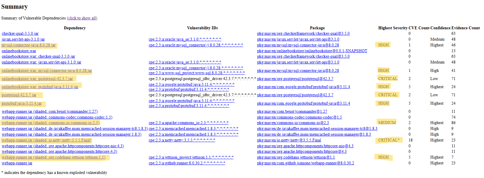
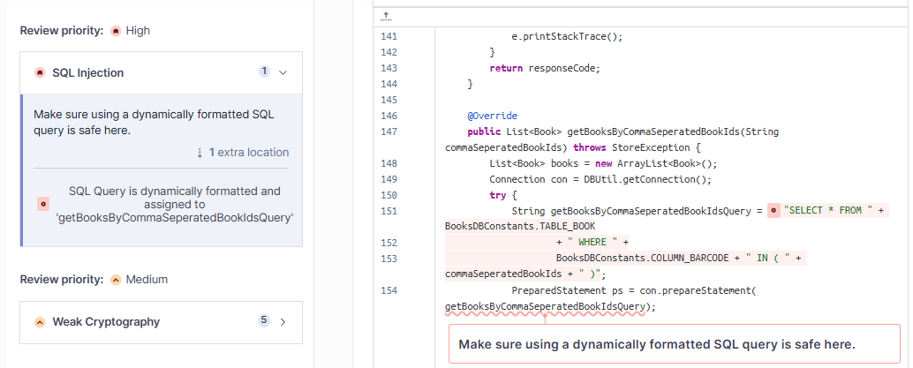
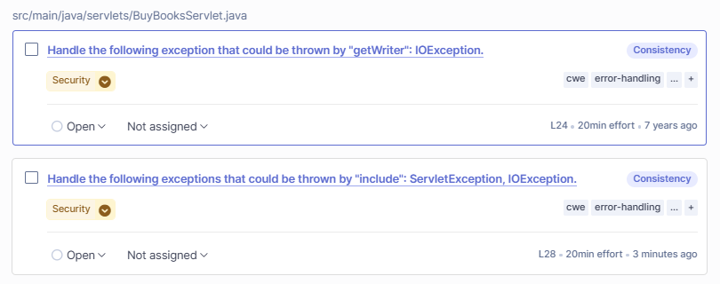
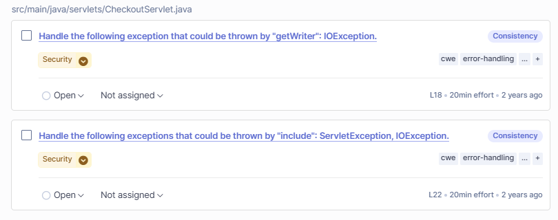
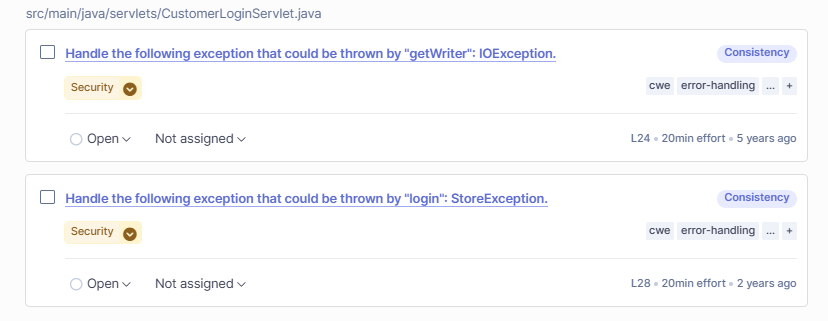

## 1. webapp-runner.jar (shaded: io.netty:netty:3.5.5.Final)

**Nome Dipendenza/Componente:**  io.netty:netty (inglobata in webapp-runner.jar)
Nota: Netty è "shaded" all'interno di webapp-runner.jar, il che significa che non è una dipendenza diretta esterna ma è inclusa nel pacchetto. Questo può rendere l'aggiornamento più complesso.
**Descrizione:** Netty è una libreria Java ad alte prestazioni per la programmazione di applicazioni di rete asincrone e basate su eventi, utilizzata per gestire comunicazioni TCP/UDP efficienti e scalabili.
**Versione Affetta:** 3.5.5.Final (inglobata in webapp-runner.jar)  
**ID Vulnerabilità:** CVE-2019-20444, CVE-2019-20445, CVE-2015-2156, CVE-2019-16869, CVE-2020-11612, CVE-2021-37136, CVE-2021-37137, CVE-2022-41881, CVE-2023-44487  

### Natura della Flaw  
Questa è una versione obsoleta di Netty, non più supportata e contenente diverse vulnerabilità critiche. I rischi principali includono:  
- HTTP Request Smuggling (bypass autenticazione, hijacking, injection)  
- Remote DoS (OOME/StackOverflow) tramite input crafted  
- Bypass httpOnly, fuga cookie/sessione  
- CVE attivamente sfruttate (es. CVE-2023-44487, HTTP/2 Rapid Reset Attack)  

### Classificazione  
- A06:2021 – Componenti Vulnerabili e Obsoleti  
- A03:2021 – Injection (Request Smuggling)  
- A08:2021 – Software and Data Integrity Failures (Deserializzazione)  
- A01:2021 – Broken Access Control (httpOnly bypass, Smuggling)  

### Gravità  
CRITICAL (CVSS 9.0–9.8)  
Rischi: esecuzione remota, bypass sicurezza, DoS completo. Diverse CVE sono "known exploited in the wild" (CISA KEV).  

### Sfruttabilità  
Alta, "known exploited" con PoC pubblici o exploit attivi.  

### Contesto Applicativo  
webapp-runner.jar esegue onlinebookstore.war. Se esposto, la vulnerabilità è accessibile da Internet.  

### Mitigazione/Fix  
Aggiornare immediatamente webapp-runner.jar a versione che includa Netty 4.x o superiore. Nessun workaround efficace a lungo termine.  

### Raccomandazioni  
- Scansioni di vulnerabilità integrate in CI/CD  
- Aggiornamenti regolari delle dipendenze  
- Isolamento dell'applicazione  

## 2. postgresql-42.3.7

**Nome Dipendenza/Componente:** org.postgresql:postgresql (PostgreSQL JDBC Driver)  
**Descrizione:** Driver JDBC per PostgreSQL che permette alle applicazioni Java di connettersi e interagire con database PostgreSQL in modo efficiente e affidabile.
**Versione Affetta:** 42.3.7  
**ID Vulnerabilità:** CVE-2024-1597, CVE-2022-41946 (2 CVE totali)  

### Natura della Flaw  
- **CVE-2024-1597:** SQL Injection (CWE-89) attivabile solo se `PreferQueryMode=SIMPLE` è configurato (non predefinita). Richiede sintassi specifica: `-` prima di un valore numerico e un secondo placeholder stringa sulla stessa riga.  
- **CVE-2022-41946:** Information Disclosure (CWE-668, CWE-200, CWE-377). L’uso di `setText()` o `setBytea()` con `InputStream > 2k` crea file temporanei leggibili da altri utenti su sistemi Unix-like.  

### Classificazione  
- OWASP A03:2021 (Injection - SQL Injection)  
- OWASP A06:2021 (Componenti Vulnerabili e Obsoleti)  

### Gravità  
- CVE-2024-1597: CRITICAL (CVSS Base Score 9.8)  
- CVE-2022-41946: MEDIUM (CVSS Base Score 5.5)  
Impatto su riservatezza, integrità e disponibilità (CVE-2024-1597) e su riservatezza locale (CVE-2022-41946).  

### Sfruttabilità  
- CVE-2024-1597: Alta – AV:N/AC:L/PR:N/UI:N  
- CVE-2022-41946: Locale – AV:L/AC:L/PR:L/UI:N  
La SQLi è sfruttabile da remoto senza autenticazione, ma solo con configurazione specifica. L’altra è locale e dipende dalla gestione dei file temporanei.  

### Contesto Applicativo  
`postgresql-42.3.7.jar` è dentro `onlinebookstore.war` (`/WEB-INF/lib/postgresql-42.3.7.jar`). Se l’applicazione è esposta e usa configurazioni vulnerabili, entrambe le falle possono essere sfruttate.  

### Mitigazione/Fix  
- Aggiornare il driver PostgreSQL JDBC a versioni non vulnerabili:  
  - 42.7.2 o superiore  
  - 42.6.1 o superiore  
  - 42.5.5 o superiore  
  - 42.4.4 o superiore  
  - 42.3.9 o superiore  
  - 42.2.28 o superiore  
- Workaround CVE-2024-1597: non usare `PreferQueryMode=SIMPLE`  
- Workaround CVE-2022-41946: su Java ≤ 1.6, impostare `java.io.tmpdir` su directory privata  

### Raccomandazioni  
- Aggiornare subito il driver JDBC alla versione più recente e sicura  
- Verificare e correggere configurazioni JDBC (query mode, directory temporanee)  
- Integrare scansioni di vulnerabilità nel processo CI/CD  
- Mantenere aggiornate tutte le dipendenze  
- Applicare il principio del minimo privilegio agli utenti database  

## 3. protobuf-java-3.11.4.jar

**Nome Dipendenza/Componente:** com.google.protobuf:protobuf-java  
**Descrizione:** Libreria Java per la serializzazione e deserializzazione di dati usando Protocol Buffers, un formato efficiente e compatto sviluppato da Google per lo scambio strutturato di dati.
**Versione Affetta:** 3.11.4  
**ID Vulnerabilità:**  
- CVE-2024-7254  
- CVE-2022-3171  
- CVE-2022-3509  
- CVE-2022-3510  
- CVE-2021-22569  

### Natura della Flaw  
- Deserializzazione insicura:  possibile Remote Code Execution (RCE) se l’input serializzato è controllato da un attaccante.
- Denial of Service (DoS): blocco applicazione (anche tramite buffer overflow) con input malevolo o troppo grande. 
- Fuga di informazioni: possibile accesso a dati sensibili durante la deserializzazione  

### Classificazione  
- OWASP A06:2021 (Componenti Vulnerabili e Obsoleti)  
- Potenzialmente OWASP A08:2021 (Failure di Integrità di Software e Dati) o A04:2021 (Insecure Design), a seconda delle CVE specifiche  

### Gravità  
HIGH, con impatti da DoS a RCE o compromissione dati  

### Sfruttabilità  
Non dichiarata come "known exploited", ma rischio significativo vista la gravità e frequenza degli attacchi su librerie di serializzazione  

### Contesto Applicativo  
`protobuf-java-3.11.4.jar` è incluso in `onlinebookstore.war`. Se l’app riceve input esterni che vengono deserializzati con questa libreria, la vulnerabilità è esposta.  

### Mitigazione/Fix  
- Aggiornare protobuf-java alla versione 3.21.7 o superiore (o alla versione che corregge tutte le CVE segnalate)

### Raccomandazioni  
- Aggiornare sempre alla versione più recente e stabile  
- Validare e sanificare rigorosamente gli input prima della deserializzazione  
- Applicare il principio del minimo privilegio nelle autorizzazioni  
- Monitorare e loggare comportamenti anomali per identificare tentativi di sfruttamento  

## 4. jettison:1.1

**Nome Dipendenza/Componente:** org.codehaus.jettison:jettison  
**Descrizione:** Jettison è una libreria che converte JSON in XML e viceversa. La versione 1.1 contiene vulnerabilità note.
**Versione Affetta:** 1.1 (inglobata in onlinebookstore.war)  
**ID Vulnerabilità:** CVE-2022-40149, CVE-2022-40150, CVE-2022-45685, CVE-2022-45693, CVE-2023-1436 (5 CVE totali)  

### Natura della Flaw  
- Iniezione XML/JSON tramite input esterno non sanificato  
- Deserializzazione insicura: input malevoli possono causare RCE, DoS o divulgazione dati  
- Denial of Service (DoS): input JSON/XML craftato che provoca crash o rallentamenti  
- XML External Entity (XXE): rischio se parser XML non disabilita entità esterne  

### Classificazione  
- OWASP A06:2021 (Componenti Vulnerabili e Obsoleti)  
- Potenzialmente OWASP A03:2021 (Injection), per iniezione o XXE  
- Potenzialmente OWASP A08:2021 (Software and Data Integrity Failures), per RCE o dati corrotti via deserializzazione  

### Gravità  
HIGH (5 CVE). Impatti possibili: DoS, compromissione integrità dati, disponibilità, esecuzione codice arbitrario, lettura di file locali sul server (XXE), esecuzione di richieste verso host interni (SSRF). 

### Sfruttabilità  
Non dichiarata come "known exploited", ma alta probabilità di attacchi noti vista la gravità e numero di CVE. Facilità di sfruttamento dipende dall’uso dell’app.  

### Contesto Applicativo  
Jettison 1.1 è presente in `/WEB-INF/lib/jettison-1.1.jar` dentro `onlinebookstore.war`. Se l’app accetta input JSON/XML da esterni, la vulnerabilità è esposta.  

### Mitigazione/Fix  
Aggiornare Jettison ad almeno la versione 1.5.4, che corregge tutte le CVE elencate

### Raccomandazioni  
- Aggiornare subito la libreria alla versione più recente
- Evitare l’uso diretto di new JSONObject(xmlString) su input non controllato.  
- Validare e sanificare rigorosamente input JSON/XML prima della deserializzazione  
- Configurare parser XML per disabilitare entità esterne (XXE)  
- Implementare monitoraggio e logging per rilevare attacchi o anomalie

## 5. mysql-connector-java-8.0.28.jar

**Nome Dipendenza/Componente:** mysql:mysql-connector-java (MySQL Connector/J)  
**Descrizione:** Driver JDBC ufficiale di MySQL per connettere applicazioni Java al database MySQL, gestendo comunicazioni, autenticazione e operazioni SQL.
**Versione Affetta:** 8.0.28  
**ID Vulnerabilità:** CVE-2023-22102 (1 CVE)

### Natura della Flaw  
- Improper Access Control (CWE-284)  
- Attaccante non autenticato con accesso rete può compromettere MySQL Connector/J
- Alcuni difetti sono legati alla gestione errata di pacchetti di handshake, che possono essere sfruttati per causare denial-of-service, memory leak, o potenziali escalation in caso di configurazioni deboli
- Richiede interazione umana da terzi  
- Attacco può portare al controllo completo del connettore

### Classificazione  
- OWASP A06:2021 (Componenti Vulnerabili e Obsoleti)  
- OWASP A01:2021 (Broken Access Control)

### Gravità  
**HIGH (CVSS 3.1 Base Score 8.3)**  
Impatto su **Confidenzialità**, **Integrità** e **Disponibilità**

### Sfruttabilità  
- Complessità: alta (richiede interazione umana)  
- Vettore: rete (AV:N)  
- Stato: **non "known exploited"**, ma rischio significativo

### Contesto Applicativo  
Incluso in `onlinebookstore.war`, il connettore gestisce le connessioni a database MySQL.  
Se esposto a rete e con configurazioni vulnerabili, è a rischio.

### Mitigazione/Fix  
- Aggiornare a com.mysql:mysql-connector-j versione **9.0.0** o superiore (ultima stabile disponibile)
- Tutte le versioni **8.0.x** di mysql:mysql-connector-java sono vulnerabili

**Nota:** la versione 9.x introduce breaking changes, inclusi il cambio di groupId e modifiche API, ma è la versione consigliata per nuove configurazioni e aggiornamenti di sicurezza.

### Raccomandazioni 
- Aggiornare subito alla versione più recente e sicura  
- Applicare principio del minimo privilegio sulle credenziali database  
- Isolare la rete per limitare l’accesso a database e applicazione  
- Sensibilizzare gli utenti su vettori di attacco (es. phishing)  
- Evitare configurazioni deboli come useSSL=false 
- **Monitorare i log JDBC** per rilevare connessioni sospette o anomale

## 6. commons-io:2.3

**Nome Dipendenza/Componente:** commons-io:commons-io  
**Descrizione:** Libreria Java che facilita operazioni di input/output su file e stream.  
**Versione Affetta:** 2.3 (inglobata in webapp-runner.jar)  
**ID Vulnerabilità:** CVE-2021-29425, CVE-2024-47554 (2 CVE totali)  

### Natura della Flaw  
- **CVE-2021-29425:** Directory Traversal (CWE-22, CWE-20). Il metodo `FileNameUtils.normalize` può restituire percorsi non sanitizzati, permettendo accesso o scrittura fuori dalle directory previste.  
- **CVE-2024-47554:** Denial of Service (CWE-400). La classe `XmlStreamReader` può consumare eccessive risorse CPU con input appositamente creati.  

### Classificazione  
- OWASP A06:2021 (Componenti Vulnerabili e Obsoleti)  
- Possibile OWASP A08:2021 (Software and Data Integrity Failures)  
- Possibile OWASP A01:2021 (Broken Access Control), in base al contesto  

### Gravità  
- Media (MEDIUM) per entrambe, con impatti su disponibilità, integrità e riservatezza parziali.  
- Potenziale esposizione a lettura o scrittura non autorizzata di file sensibili.  

### Sfruttabilità  
- CVE-2021-29425: sfruttabile da remoto senza autenticazione, con complessità medio-alta.  
- CVE-2024-47554: sfruttabile da remoto con complessità bassa, richiede interazione utente.  
- Dipende dal contesto applicativo e dall’uso delle funzionalità vulnerabili.  

### Contesto Applicativo  
Commons IO 2.3 è inglobata in webapp-runner.jar, usato per eseguire onlinebookstore.war. Le vulnerabilità sono rilevanti se l’app elabora file o stream da input esterni.  

### Mitigazione/Fix  
- Aggiornare webapp-runner.jar a versione che include Commons IO aggiornata, almeno alla 2.11.0 o preferibilmente 2.14.0.  

### Raccomandazioni  
- Aggiornare la libreria all’ultima versione stabile.  
- Validare e sanificare rigorosamente percorsi e contenuti di file provenienti da input esterni.  
- Usare `new File(baseDir, safeFileName).getCanonicalPath()` per prevenire path traversal.  
- Applicare whitelist per nomi file e limitare privilegi di accesso ai file per ridurre i danni in caso di sfruttamento.  

## 7. possibile SQL injection

**Nome Componente:** `BookServiceImpl.java`  
**Descrizione:** La costruzione dinamica della query SQL concatenando direttamente la stringa commaSeperatedBookIds senza parametrizzazione espone a vulnerabilità di SQL Injection. Un attaccante potrebbe manipolare questo input per eseguire comandi SQL arbitrari, compromettendo la sicurezza e l’integrità del database.

**Riga affetta:** Linea 151  
**ID Regola Sonar:** `java:S2077`    
**File:** `src/main/java/com/bittercode/service/impl/BookServiceImpl.java`  

### Natura della Flaw  
La costruzione dinamica della query SQL concatenando direttamente la stringa commaSeperatedBookIds espone l’applicazione a rischi di SQL Injection. Senza validazione o parametrizzazione, un input malevolo può alterare la query, causando:

- Esecuzione di comandi SQL non previsti
- Accesso o modifica non autorizzata ai dati
- Potenziale compromissione dell’intero database

L’assenza di controlli espliciti sulle eccezioni SQL peggiora il rischio, impedendo una gestione corretta degli errori e facilitando exploit.

### Classificazione  
- **CWE-89** – Improper Neutralization of Special Elements used in an SQL Command (SQL Injection)  
- **CWE-20** – Improper Input Validation  
- **OWASP A03:2021 – Injection**  
- **OWASP A01:2017 – Injection**  
- **CERT IDS00-J** – Prevent SQL Injection

### Gravità  
**HIGH**  
**Rischi:**  
- Accesso non autorizzato a dati sensibili  
- Modifica o cancellazione non autorizzata di dati  
- Esecuzione di comandi SQL arbitrari  
- Compromissione dell’integrità e riservatezza dei dati  
- Potenziale escalation verso Remote Code Execution (RCE)  
- Interruzione del servizio (Denial of Service)  

### Sfruttabilità  
Alta. Può permettere a un attaccante di eseguire query SQL arbitrarie, accedere o modificare dati sensibili, o ottenere controllo remoto sul sistema.

### Contesto Applicativo  
La classe BookServiceImpl implementa operazioni CRUD su entità Book tramite query SQL eseguite su un database relazionale. La funzione getBooksByCommaSeperatedBookIds costruisce dinamicamente una query concatenando direttamente input esterno non sanitizzato nella clausola SQL IN. Questo espone il componente a rischi di SQL Injection, permettendo a un attaccante di manipolare la query e potenzialmente accedere o modificare dati non autorizzati.

L’assenza di gestione esplicita delle eccezioni SQLException e di log aumenta il rischio di malfunzionamenti silenti e difficili da diagnosticare.

### Mitigazione/Fix  
Gestire `IOException` con un blocco `try-catch`, log sicuro, e invio di errore controllato:  
```java
@Override
public List<Book> getBooksByCommaSeperatedBookIds(String commaSeparatedBookIds) throws StoreException {
    List<Book> books = new ArrayList<>();
    String[] ids = commaSeparatedBookIds.split(",");
    String placeholders = String.join(",", Collections.nCopies(ids.length, "?"));

    String query = "SELECT * FROM " + BooksDBConstants.TABLE_BOOK +
                   " WHERE " + BooksDBConstants.COLUMN_BARCODE + " IN (" + placeholders + ")";

    try (Connection con = DBUtil.getConnection();
         PreparedStatement ps = con.prepareStatement(query)) {

        for (int i = 0; i < ids.length; i++) {
            ps.setString(i + 1, ids[i].trim());
        }

        try (ResultSet rs = ps.executeQuery()) {
            while (rs.next()) {
                books.add(new Book(
                    rs.getString(1),
                    rs.getString(2),
                    rs.getString(3),
                    rs.getInt(4),
                    rs.getInt(5)));
            }
        }
    } catch (SQLException e) {
        LOGGER.severe("Error in getBooksByCommaSeperatedBookIds: " + e.getMessage());
        throw new StoreException(ResponseCode.DATABASE_CONNECTION_FAILURE);
    }
    return books;
}
```


## 8. Gestione non sicura di IOException (getWriter)

**Nome Componente:** `BuyBooksServlet.java`  
**Descrizione:** Il metodo `res.getWriter()` può lanciare una `IOException`, ma non viene gestita. Questo comporta una potenziale interruzione anomala del flusso dell'applicazione o leak di informazioni di errore lato server.

**Riga affetta:** Linea 24  
**ID Regola Sonar:** `java:S1989`  
**Tag:** `cwe`, `error-handling`  
**File:** `src/main/java/servlets/BuyBooksServlet.java`  

### Natura della Flaw  
Il metodo `getWriter()` può fallire in caso di problemi con il flusso di output della risposta HTTP (es. connessione chiusa, errore I/O). Senza gestione esplicita dell’eccezione, l’applicazione può:  
- Rispondere in modo inconsistente  
- Esibire stack trace lato client in ambienti malconfigurati  
- Esporre dettagli del server  

### Classificazione  
- **CWE-703** – Improper Check or Handling of Exceptional Conditions  
- **OWASP A05:2021 – Security Misconfiguration**  
- **OWASP A09:2021 – Security Logging and Monitoring Failures** (se non logga l’errore)

### Gravità  
**MEDIUM**  
**Rischi:**  
- Blocchi o crash dell’applicazione  
- Leak di stack trace e dettagli interni  
- Denial of Service locale su endpoint specifici  

### Sfruttabilità  
Media. Non porta a esecuzione remota di codice, ma può causare malfunzionamenti e rivelare struttura interna.

### Contesto Applicativo  
`BuyBooksServlet` gestisce richieste POST per acquisti. In caso di errore, la risposta HTTP risulta corrotta e l’operazione si interrompe anormalmente.

### Mitigazione/Fix  
Gestire `IOException` con un blocco `try-catch`, log sicuro, e invio di errore controllato:  
```java
try {
    PrintWriter pw = res.getWriter();
    res.setContentType(BookStoreConstants.CONTENT_TYPE_TEXT_HTML);
    // ...
} catch (IOException e) {
    log.error("Errore durante la scrittura della risposta", e);
    res.sendError(HttpServletResponse.SC_INTERNAL_SERVER_ERROR, "Errore interno.");
    return;
}
```
### Raccomandazioni
- Non lasciare eccezioni checked non gestite nei servlet.
- Loggare sempre errori in modo sicuro senza esporre dettagli all’utente.
- Fornire messaggi di errore generici e user-friendly.
- Integrare test di sicurezza specifici sulla gestione delle eccezioni.

## 9. Gestione eccezioni Servlet in CheckoutServlet

**Nome Componente:** `CheckoutServlet.java`  
**Descrizione:** Il metodo doPost non gestisce internamente le eccezioni ServletException e IOException generate da RequestDispatcher.include(). Ciò può causare crash o esposizione di informazioni sensibili.

**Riga affetta:** Linea 22  
**ID Regola Sonar:** `java:S1989`  
**Tag:** `cwe`, `error-handling`  
**File:** `src/main/java/servlets/CheckoutServlet.java`  

### Natura della Flaw  
La mancata cattura delle eccezioni checked durante RequestDispatcher.include() può:

- Far propagare eccezioni al contenitore servlet con crash o comportamenti inattesi
- Causare denial-of-service su endpoint critici
- Esporre stack trace e configurazioni sensibili all’utente finale

### Classificazione  
- CWE-600: Uncaught Exception in Servlet  
- Impatto su sicurezza e consistenza del software  

### Gravità  
**MEDIUM-HIGH**  
**Rischi:** Denial of Service e perdita di informazioni riservate.


### Sfruttabilità  
Potenzialmente elevata in caso di input malformati o errori interni.

### Contesto Applicativo  
Servlet responsabile di login e gestione pagamento. Mancata gestione eccezioni può bloccare il flusso e mostrare errori non controllati.

### Mitigazione/Fix  
Avvolgere chiamate potenzialmente pericolose in try-catch che gestiscono ServletException e IOException:

```java
try {
    rd.include(req, res);
} catch (ServletException | IOException e) {
    // Log dell'eccezione in modo sicuro
    log.error("Errore durante l'include della risorsa", e);
    // Invio risposta HTTP di errore controllata
    res.sendError(HttpServletResponse.SC_INTERNAL_SERVER_ERROR, "Errore interno al server");
    return;
}
```
### Raccomandazioni
- Gestire tutte le eccezioni checked interne ai servlet.
- Evitare la propagazione delle eccezioni al container.
- Fornire messaggi di errore generici e log sicuri.
- Implementare test di sicurezza sulla gestione delle eccezioni.


## 10. Gestione eccezione StoreException in CustomerLoginServlet#doPost

**Nome Componente:** `CustomerLoginServlet.java`  
**Descrizione:**  
Il metodo doPost chiama authService.login che può lanciare una StoreException custom non gestita internamente, causando potenziali crash o leak di informazioni.

**Riga affetta:** Linea 28 
**ID Regola Sonar:** `java:S1989`  
**Tag:** `cwe`, `error-handling`  
**File:** `src/main/java/servlets/CustomerLoginServlet.java`  

### Natura della Flaw  
Le eccezioni non gestite in servlet possono:
- Instabilizzare il container causando denial-of-service
- Esporre informazioni sensibili (stack trace, configurazioni)  
- compromettere la sicurezza e la stabilità del sistema

### Classificazione  
- CWE-600: Uncaught Exception in Servlet  
- Rischio di esposizione dati e DoS

### Gravità  
**MEDIUM**  
**Rischi:** sicurezza e stabilità applicativa compromesse.

### Sfruttabilità  
Dipende dal contesto, ma espone a DoS e leak informativi.

### Contesto Applicativo  
Servlet responsabile del login cliente in un’applicazione web Java, che non gestisce StoreException durante la chiamata a authService.login.

### Mitigazione/Fix  
Gestire StoreException (e altre) con try-catch interno a doPost:

```java
public void doPost(HttpServletRequest req, HttpServletResponse res) throws IOException, ServletException {
    PrintWriter pw = res.getWriter();
    try {
        User user = authService.login(UserRole.CUSTOMER, uName, pWord, req.getSession());
        if (user != null) {
            RequestDispatcher rd = req.getRequestDispatcher("CustomerHome.html");
            rd.include(req, res);
            pw.println("<div id=\"topmid\"><h1>Welcome to Online <br>Book Store</h1></div>");
        } else {
            // gestione login fallito
        }
    } catch (StoreException e) {
        logger.error("Errore durante login cliente", e);
        pw.println("Errore interno, riprova più tardi.");
    }
}
```
### Raccomandazioni  
- Non propagare eccezioni fuori dai metodi doGet/doPost dei servlet.  
- Gestire tutte le eccezioni internamente con try/catch.  
- Fornire messaggi di errore user-friendly senza leak di informazioni sensibili.  
- Integrare test di sicurezza e revisione codice specifica per gestione eccezioni in servlet.


## Screenshot delle rilevaizoni




